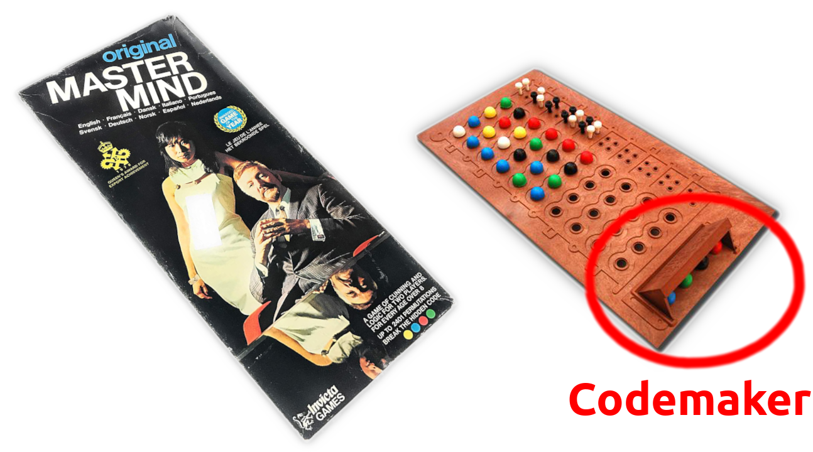
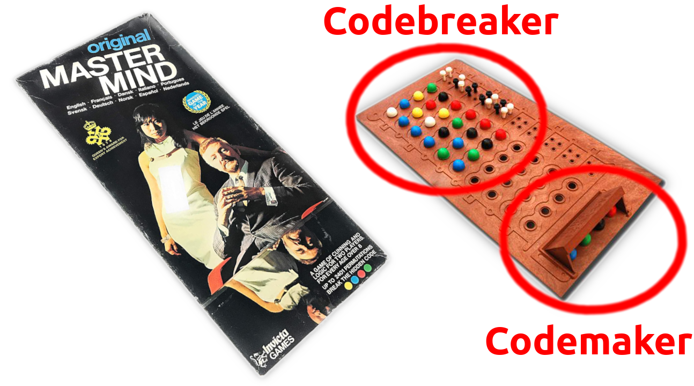

# Memory lane!

Does anyone remember the game of Mastermind?

::: notes
...
:::

##

{ width="80%" }

::: notes
...
:::

##

{ width="80%" }

::: notes
...
:::

##

{ width="80%" }

::: notes
...
:::

## An explanation for Gen Z

::: notes
...
:::

# Let's code it up!

* Codemaker
* Codebreaker (solvers)

C++20 style { width="5%" }

## The goals and requirements

* Set my own coding rules,
* Use the fanciest tools I can find,
* Apply best-practices,
* Learn tons of stuff!

## Some highlights

// TODO

* Ranges library
* Docopt.cpp
* Build system setup
* Compile-time programming

## Some highlights

// TODO

* Show codemaker-side
* Show solvers

## Graphs...just because

...

## Lessons learned

* Coding for fun is great!
* There are a lots of great tools out there..
* Implementations in other languages expand your mind!

## Future plans

Other languages:

* JavaScript
* Rust

# Nerd-life

Some random tips that worked well for me

## Separation of concerns

Separate work place from hobby work place!

## All the work counts

Binge-working is counter-productive. Don't do it!

. . .

Doing a little bit every day really adds up..

# That's it!

Thanks 

http://github.com/krisvanrens/master-mind
