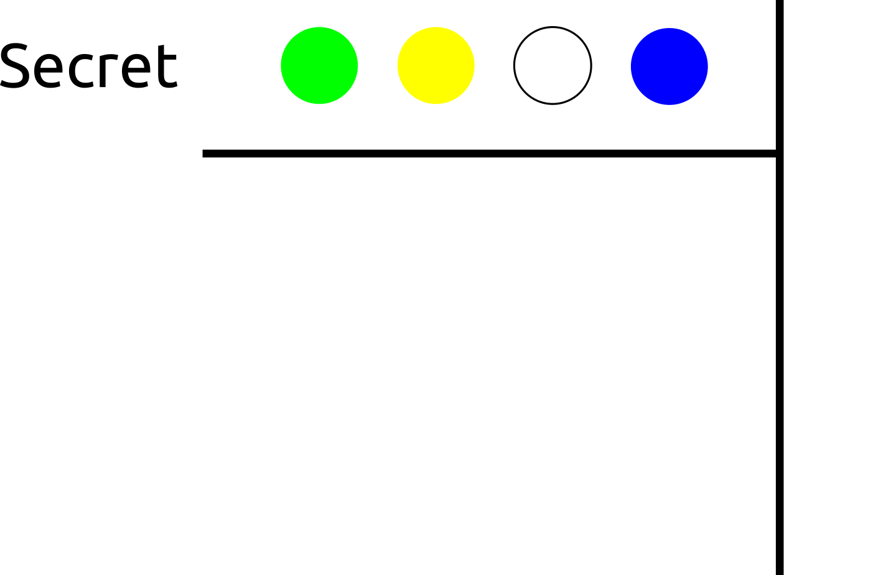
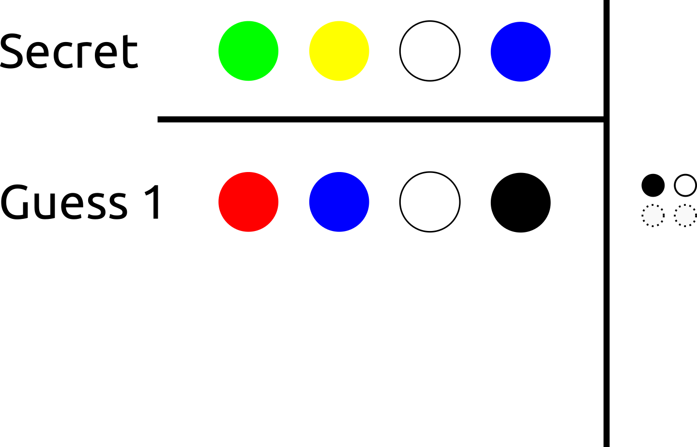
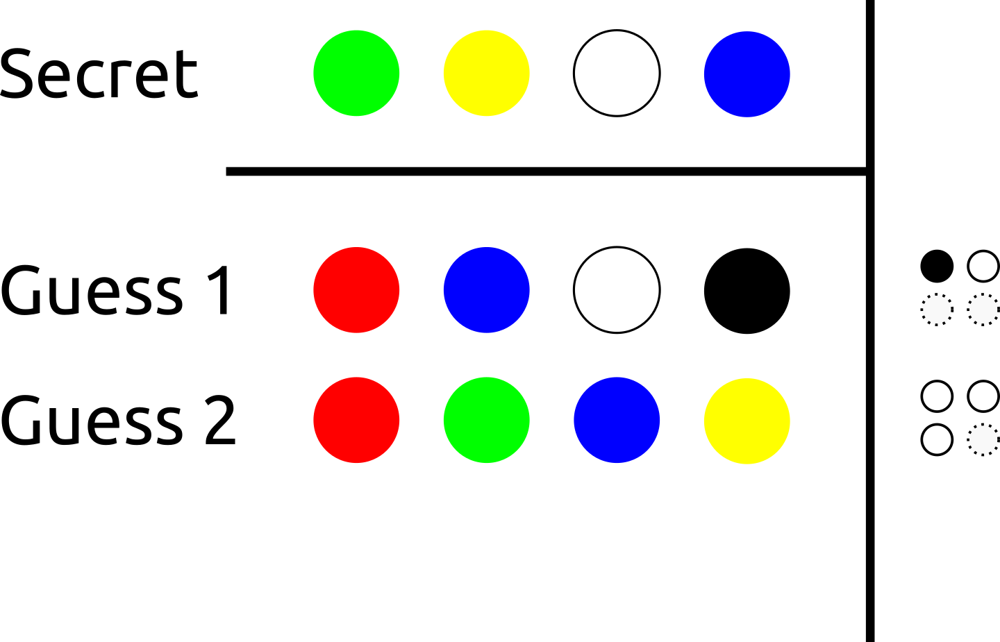
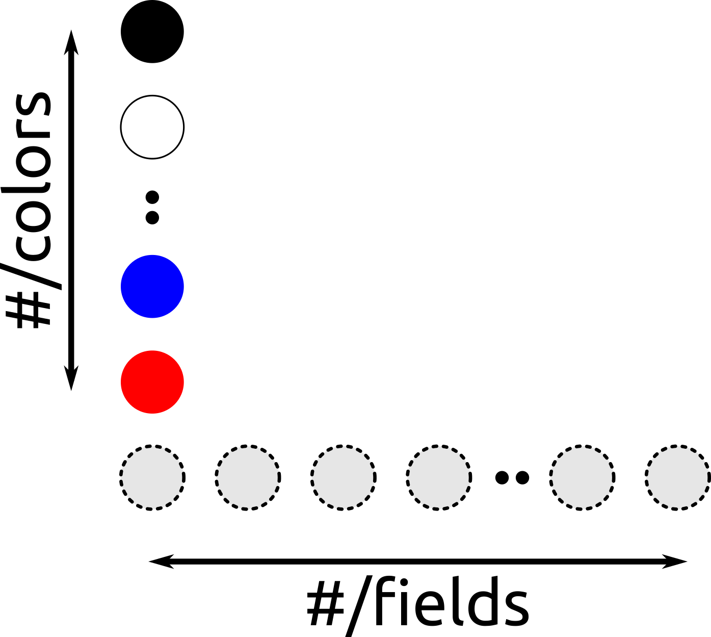
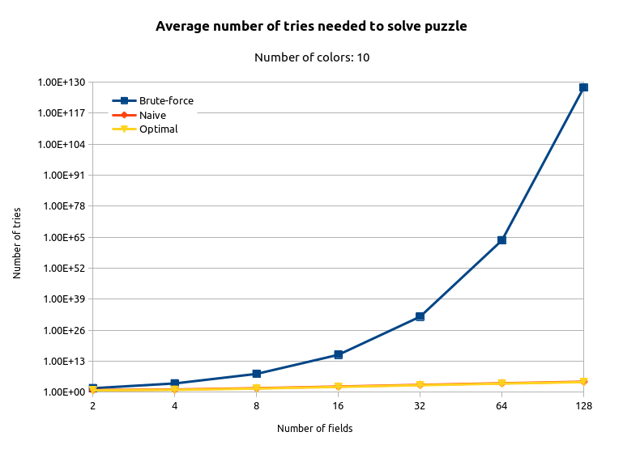
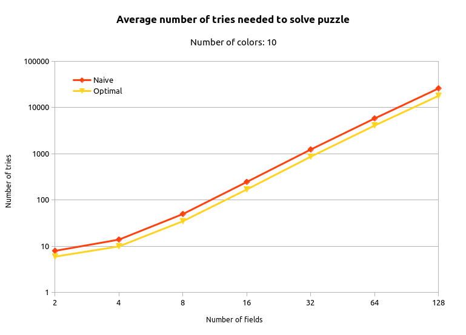

# Memory lane!

Does anyone remember the game of **Mastermind** { width="6%" }

##

{ width="80%" }

## An explanation for Gen Z

{ width="10%" }

##

{ width="80%" }

##

{ width="80%" }

##

{ width="80%" }

## Example game

{ width="40%" }

## Example game

{ width="40%" }

## Example game

{ width="40%" }

# Let's code it up!

::: columns
:::: column
Codemaker/-breaker (solvers)

C++20 style { width="4%" }

{ width="25%" }
::::
:::: column
Scalability

{ width="70%" }
::::
:::

## The goals and rules

* Rule #1: there are no rules!
* Use the fanciest new tools available
* Learn tons of stuff and have fun!

. . .

{ width="6%" }

# Highlights

## Ranges library

```c++
std::string to_string(const auto& series) {
  std::stringstream result;
  for (auto field = series.end() - 1; field >= series.begin(); --field) {
    result << field;
  }
  return result.str();
}
```
. . .
```c++
std::string to_string(const auto& series) {
  std::stringstream result;
  for_each(reverse_view{series}, [&](auto field) { result << field; });
  return result.str();
}
```

## Compile-time programming

Trying to move as much code as possible to compile-time..

E.g. `constexpr` testing:
```c++
TEST_CASE("Guess") {
  STATIC_CHECK(MasterMind{{Black, Red, Purple}}.guess({Black, Purple, Red})
               == {Correct, ColorCorrect, ColorCorrect});
}
```

## Docopt.cpp

```c++
#include <docopt/docopt.h>

constexpr auto USAGE =
  R"(Usage: master-mind-solver [-h|--help] [-q|--quiet] [-v|--verbose] [--list|SOLVER]

-h --help    Show this help info
-q --quiet   Show only the number of tries needed
-v --verbose Show detailed solver output
--list       List solvers)";
```
```c++
int main(int argc, char** argv) {
  auto args = docopt::docopt(USAGE, {std::next(argv), std::next(argv, argc)}, true);
}
```

## Running the code

```
$ bin/master-mind-solver -v naive
```
```
Trying secret #1: [00000000000000000000000000000000000000000000000000]..
Trying secret #2: [11111111111111111111111111111111111111111111111111]..

...

Trying secret #3543: [11340189940424020494819604144247522803658022502071]..
Trying secret #3544: [13840189940424020494119604144247522803658022502071]..
Solver 'naive' needed 3544 steps
```

## Graphs...just because

{ width="60%" }

## Graphs...just because

{ width="60%" }

# Future plans

{ width="15%" } { width="15%" }

# Nerd-life

{ width="8%" }

## Separation of concerns

Separate your work place from hobby work place!

{ width="8%" } { width="8%" }

## All the work counts

Binge-working is counter-productive -- don't do it! { width="3%" }

Doing a little bit every day really adds up..

{ width="6%" } { width="6%" } { width="6%" }

# That's it! { width="7%" }

[http://github.com/krisvanrens/master-mind](http://github.com/krisvanrens/master-mind)
