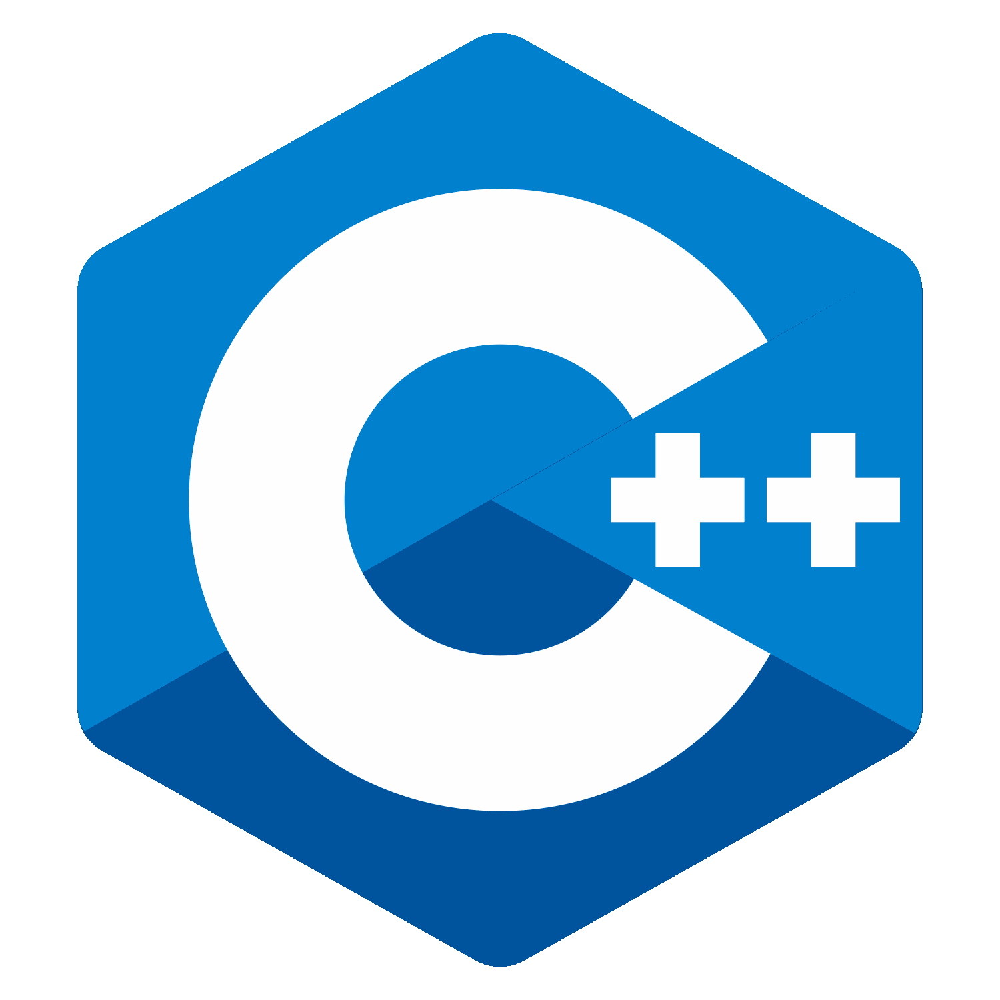
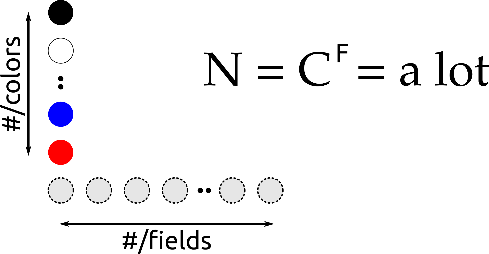

# Memory lane!

Does anyone remember the game of **Mastermind** { width="6%" }

##

{ width="80%" }

## An explanation for Gen Z

{ width="10%" }

##

{ width="80%" }

##

{ width="80%" }

##

{ width="80%" }

## Example game

{ width="40%" }

## Example game

{ width="40%" }

## Example game

{ width="40%" }

# Let's code it up!

* Codemaker
* Codebreaker (solvers)

. . .

C++20 style { width="4%" }

{ width="10%" }

## Scalability

{ width="30%" } { width="30%" }

## The goals and rules

* There are no rules!
* Use the fanciest new tools
* Apply best-practices
* Learn tons of stuff and have fun!

. . .

{ width="6%" }

# Highlights

## Build system setup

```
 CMAKE_BUILD_TYPE                 RelWithDebInfo                                                                                                                                                                
 CONAN_CMD                        /home/kris/.local/bin/conan                                                                                                                                                   
 ENABLE_CACHE                     ON                                                                                                                                                                            
 ENABLE_CLANG_TIDY                ON                                                                                                                                                                           
 ENABLE_COVERAGE                  ON                                                                                                                                                                           
 ENABLE_CPPCHECK                  ON                                                                                                                                                                           
 ENABLE_DOXYGEN                   OFF                                                                                                                                                                           
 ENABLE_INCLUDE_WHAT_YOU_USE      OFF                                                                                                                                                                           
 ENABLE_IPO                       OFF                                                                                                                                                                           
 ENABLE_SANITIZER_ADDRESS         OFF                                                                                                                                                                           
 ENABLE_SANITIZER_LEAK            OFF                                                                                                                                                                           
 ENABLE_SANITIZER_MEMORY          OFF                                                                                                                                                                           
 ENABLE_SANITIZER_THREAD          OFF                                                                                                                                                                           
 ENABLE_SANITIZER_UNDEFINED_BEH   OFF                                                                                                                                                                           
 ENABLE_TESTING                   ON                                                                                                                                                                            
 WARNINGS_AS_ERRORS               ON                                                                                                                                                                            

Press [enter] to edit option Press [d] to delete an entry
Press [c] to configure
```

## Ranges library

```c++
using namespace std::ranges;

std::string to_string(const auto& series) {
  std::stringstream result;
  for_each(reverse_view{series}, [&](auto field) { result << field; });
  return result.str();
}

static void print(std::string&& prefix, const auto& series) {
  std::cout << prefix << ": [" << to_string(series) << "]\n";
}

void print(const Secret& secret) {
  print("Secret ", secret);
}
```

## Neat tricks (1)

```c++
template<typename T>
using Container = typename std::array<T, NUMBER_OF_FIELDS>;

using Secret  = Container<Color>;
using Score   = Container<Outcome>;
using Indices = Container<unsigned int>;

template<typename T>
[[nodiscard]] constexpr auto indices(T container) {
  Indices result;
  std::iota(result.begin(), result.end(), 0);
  return result;
}
```

## Neat tricks (2)

```c++
using namespace std::ranges;

constexpr IntermediateScore MM::scoreCorrectGuesses(const Secret& secret) const {
  Score           result = {};
  Container<bool> marker = {};

  for_each(indices(secret), [&](auto index) {
    if (secret[index] == secret_[index]) {
      result[index] = Outcome::Correct;
      marker[index] = true;
    }
  });

  return {result, marker};
}
```

## Compile-time programming

Trying to move as much code as possible to compile-time..

. . .

E.g. `constexpr` testing:
```c++
TEST_CASE("Guess") {
  STATIC_CHECK(MasterMind{{Black, Red, Purple}}.guess({Black, Purple, Red})
               == {Correct, ColorCorrect, ColorCorrect});
}
```

## Debugging `constexpr` tests

Change static checks to run-time checks!

'Relaxed `constexpr`'

## Docopt.cpp

```c++
#include <docopt/docopt.h>

constexpr auto USAGE =
  R"(Usage: master-mind-solver [-h|--help] [-q|--quiet] [-v|--verbose] [--list|SOLVER]

-h --help    Show this help info
-q --quiet   Show only the number of tries needed
-v --verbose Show detailed solver output
--list       List solvers)";

int main(int argc, char** argv) {
  auto args = docopt::docopt(USAGE, {std::next(argv), std::next(argv, argc)}, true);
}
```

## Running the code

```
$ bin/master-mind-solver -v naive
```
```
Trying secret #1: [00000000000000000000000000000000000000000000000000]..
Trying secret #2: [11111111111111111111111111111111111111111111111111]..
...
Trying secret #3543: [11340189940424020494819604144247522803658022502071]..
Trying secret #3544: [13840189940424020494119604144247522803658022502071]..
Solver 'naive' needed 3544 steps
```

## Graphs...just because

{ width="60%" }

## Graphs...just because

{ width="60%" }

# Lessons learned

* Coding just for fun is great!
* There are a lots of great tools out there..
* Implementations in other languages expand your mind!

. . .

{ width="6%" }

# Future plans

{ width="15%" } { width="15%" }

# Nerd-life

{ width="8%" }

Some random tips that worked well for me..

## Separation of concerns

Separate your work place from hobby work place!

{ width="8%" } { width="8%" }

## All the work counts

Binge-working is counter-productive -- don't do it! { width="3%" }

. . .

Doing a little bit every day really adds up..

{ width="6%" } { width="6%" } { width="6%" }

# That's it! { width="7%" }

[http://github.com/krisvanrens/master-mind](http://github.com/krisvanrens/master-mind)
